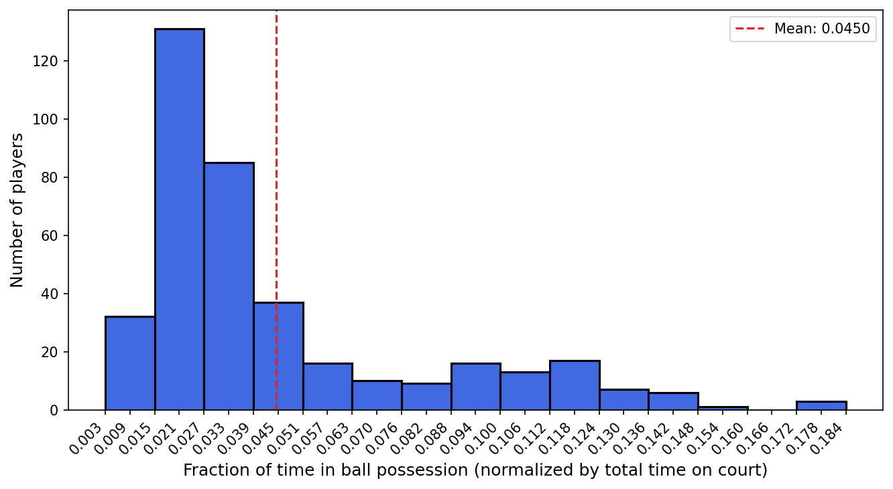
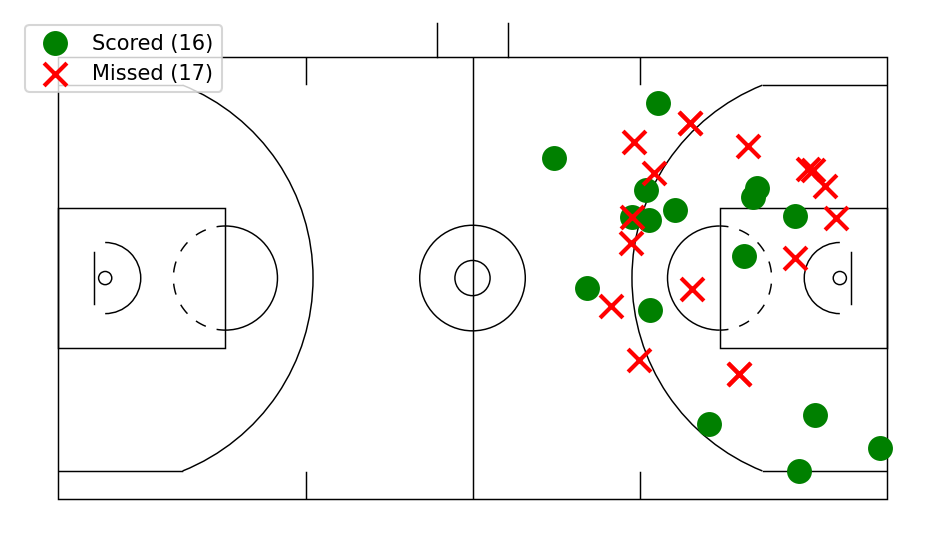

# NBA Player Tracking Analytics with Apache Spark

Distributed analysis of real NBA SportVU player-tracking data (25 Hz x/y coordinates for all players and the ball, across 84 Golden State Warriors & Cleveland Cavaliers games) using **Spark / SparkSQL** on a Hadoop (YARN) cluster.

Built for the *Big Data Analytics Programming* course. Full write-up in [`report/report.pdf`](report/report.pdf).

## What it does

Three Spark jobs turn raw per-game CSVs (play-by-play events + 25×/sec player & ball coordinates) into season-level player statistics:

| Job | Question answered | Output |
|---|---|---|
| **Distance Travelled** | How far does each player run, normalized to distance/quarter? | [`distance_per_player.csv`](report_extras/distance_per_player.csv) |
| **Ball Possession** | How much distance/time is each player in possession of the ball, as a % of time on court? | [`possession_per_player.csv`](report_extras/possession_per_player.csv) |
| **Clutch Time Efficiency** | In the final 5 minutes of close games, what's each player's 2pt/3pt shooting efficiency? | [`clutch_efficiency.csv`](report_extras/clutch_efficiency.csv) |

Distance and possession are computed from consecutive tracking "moments" via Spark SQL window functions (`lag`/`lead` partitioned by game/player/quarter, ordered by game clock). Clutch efficiency is the more involved job: it joins play-by-play shot events to tracking data on approximate timestamps (event and moment timestamps aren't perfectly synchronized) to recover the court position — and therefore 2pt vs. 3pt — of every clutch-time shot attempt.

### Ball possession distribution



Most players see very little of the ball — possession time is heavily concentrated in a handful of primary ball-handlers per team.

### Stephen Curry — clutch shot chart



Every clutch-time field goal attempt by Curry, reconstructed from tracking data and mirrored onto a single basket, marking makes vs. misses.

## Stack

- **Apache Spark 3.5** (SparkSQL / DataFrame API, window functions) — Java
- **Hadoop 3.4 / YARN** — cluster execution over the distributed dataset (~13 GB, 84 games)
- Maven build, run via `spark-submit`

## Project layout

```
Spark/
├── src/main/java/
│   ├── BasketballStatistics.java   # entry point / job dispatcher
│   ├── DistanceTravelled.java
│   ├── BallPossession.java
│   └── ClutchTimeEfficiency.java
├── distance_per_player.sh          # build + spark-submit for each job
├── possession_per_player.sh
└── clutch_efficiency.sh
```

Each `.sh` script runs `mvn clean package` followed by `spark-submit --master yarn` against the full dataset on the cluster, writing results back out as space-separated CSVs.

## Also in this repo

The same assignment included a **SIMD** component (`SIMD/lin_regression.cpp`): a hand-vectorized AVX2/FMA implementation of linear regression inference, benchmarked against a scalar baseline across five datasets (8–784 features), reaching up to **4.4x speedup**. See the [report](report/report.pdf) for full results.

## Context

This was a solo university assignment (dataset cannot be redistributed, per course terms) — the report and source above are included to document the approach and results rather than to be run standalone.